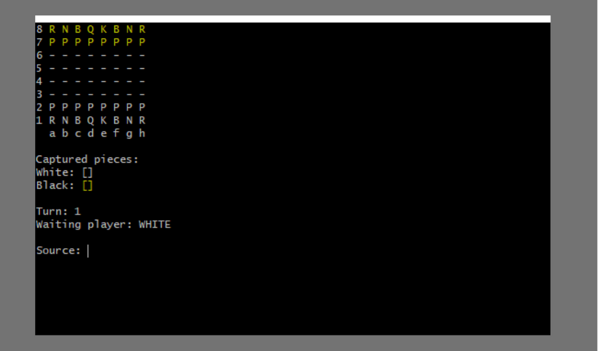
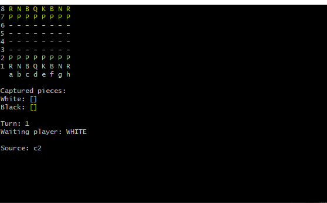
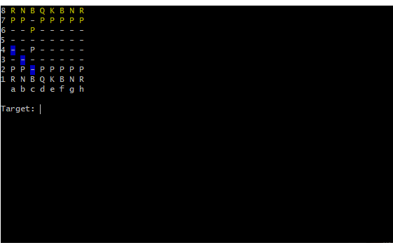
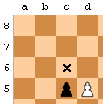
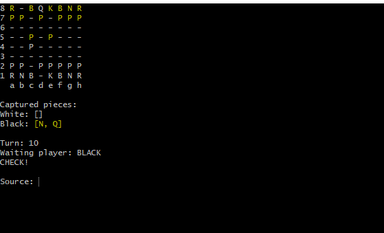

# Jogo de Xadrez com Java

Xadrez é um jogo tradicional desde muito tempo, além de ser conhecido mundialmente e ainda muito praticado nos dias de hoje, seja na questão esportiva ou didática, por conta dos seus fundamentos sólidos é possível trabalhar com esse jogo em conjunto com a programação.

Com isso desenvolvi uma aplicação no formato de um jogo de Xadrez, em conjunto aos meus estudo em  Java, com o professor <a href="https://github.com/acenelio">Nelio Alves</a>.

## Instruções para a aplicação

Antes de tudo é preciso de alguns passos para rodar essa aplicação em sua máquina.

Pré-requisitos:

<a href="https://www.oracle.com/java/technologies/downloads/"> 📥 </a> Instalado pelo menos o JDK 8 (Java Development Kit).

<a href="https://git-scm.com/downloads">📥</a> Instalado o Git.

OBS: Caso não possua nenhum dos pré-requisitos, clique no ícone e você será redirecionado para página oficial de download, após isso verifique as versões na sua máquina! 

Abra a pasta do projeto entre na pasta *bin* abra na opção *git BASH Here*. Digite o seguinte comando :

    java application/Program 

Após isso a partida irá começar, desta forma: 

As peças pretas estão da cor amarela, pois a cor de fundo do terminal do git é preta, assim foi necessário essa alteração para melhorar a visibilidade da partida.

## Tecnologias usadas

Nessa aplicação foi utilizado apenas a linguagem Java em uma interface do Git. Utilizando técnicas da POO (Programação Orientada a Objetos), trabalhando com Herança, Polimorfiso, Exceções personalizadas etc. 

 

## Como jogar?

Quando a partida se inicia as peças brancas devem efetuar a primeira jogada. Nessa aplicação as respectivas peças do xadrez são representadas por suas iniciais:

- ♟️ Pawn 
- ♜ Rook  
- ♝ Bishop 
- ♞ Knight
- ♛ Queen
- ♚ King

Para conseguir mover as peças é necessário digitar a coluna e a linha desejada, desta forma: c1, d4, e8 etc.

Após digitado a posição da peça escolhida é mostrado na tela as possibilidades que o jogador tem para mover a sua peça.
No xadrez cada peça tem uma possibilidade de movimento diferente, assim depende da peça que o jogador escolher. 

Além disso caso o jogador fizer uma jogada que fuja das regras do xadrez ele será notificado, tendo a possibilidade de efetuar novamente a jogada, apertando *Enter*.

## Regras e Movimentos Especiais

### En Passant

É um movimento especial de captura dos peões, quando um peão avança duas casas e está na coluna adjacente do adversário, porém muda de acordo com a cor das peças.

Peças brancas: Caso haja um peão(Pawn) preta na coluna adjacente e na linha 4.

Peças Pretas: Caso haja um peão(Pawn) branca na coluna adjacente e na linha 5.

  

### Promoção 

É um movimento especial dos peões, pois quando um peão alcança a oitava linha de seu adversário ele pode trocar de peça, assim esse peão será retirado do jogo, de acordo com as opções e a escolha do jogador, esse peão poderá ser trocado pelas seguintes peças:

- ♜ Rook  
- ♝ Bishop 
- ♞ Knight
- ♛ Queen

### Check

A regra check consiste na ameaça do rei, ou seja a peça **K**ing, de uma ou mais peças que  adversárias podem capturar o rei do jogador em check, assim quando o jogador é notificado na tela ele deve proteger-se da ameaça. 

Caso o jogador faça uma jogada que o mantenha em check ele deve refazer a jogada para assim continuar a partida.

### CheckMate

Quando o rei de algum jogador for capturado ou não houver mais alguma possibilidade para escapar-se, a partida será encerrada, mostrando 
a cor das peças que venceram. 

# Créditos

- <a href="https://github.com/acenelio">Nelio Alves</a>.

- <a href="https://www.udemy.com/course/java-curso-completo/">Curso Java</a>.

# Autor 

- <a href="https://github.com/uKRUGER11">Gabriel Kruger</a>.

### Como contribuir ?

Muito Simples! Meu único objetivo é que eu tenha te ensinado algo, ou te incentivado para criar sua própria aplicação, pois isso já é de grande contribuição.

    

